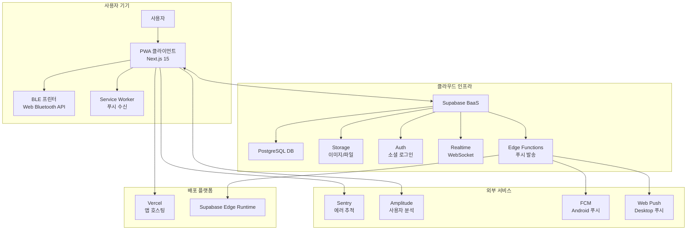

# FAXI - Technical Requirements Document (TRD)

## 📋 문서 정보
- **버전**: 1.0
- **작성일**: 2025-08-06
- **프로젝트 상태**: MVP 75% 완료 (푸시알림 미구현)
- **기술 스택**: Next.js 15 + Supabase + Web Bluetooth API
- **다음 검토일**: MVP 출시 후

---

## 🏗️ 1. 시스템 아키텍처 개요

### 1.1 High-Level Architecture



### 1.2 핵심 기술 스택

| 계층 | 기술 | 버전 | 선정 사유 |
|------|------|------|-----------|
| **프론트엔드** | Next.js | 15.4.5 | App Router, React 19, Turbopack 지원 |
| **UI 프레임워크** | React | 19.0.0 | 최신 기능 활용, 성능 최적화 |
| **타입스크립트** | TypeScript | 5.x | 타입 안전성, 개발 생산성 |
| **스타일링** | Tailwind CSS | 3.4.1 | 유틸리티 우선, 빠른 개발 |
| **UI 컴포넌트** | Radix UI (shadcn/ui) | 최신 | 접근성, 커스터마이징 용이 |
| **상태 관리** | Zustand | 4.x | 경량화, 타입스크립트 친화적 |
| **서버 상태** | TanStack Query | 5.x | 캐싱, 동기화, 성능 최적화 |
| **백엔드** | Supabase | 2.53.0 | BaaS, 빠른 개발, 실시간 기능 |
| **데이터베이스** | PostgreSQL | - | Supabase 관리, 관계형 데이터 |
| **실시간 통신** | Supabase Realtime | - | WebSocket 기반, 실시간 업데이트 |
| **인증** | Supabase Auth | - | 소셜 로그인, JWT 기반 |
| **파일 저장** | Supabase Storage | - | 이미지 업로드, CDN |
| **배포** | Vercel | - | Next.js 최적화, CI/CD |
| **푸시 알림** | FCM + Web Push API | - | 크로스 플랫폼 푸시 알림 |
| **서버리스** | Supabase Edge Functions | - | 푸시 발송 로직, 백그라운드 작업 |
| **모니터링** | Sentry | - | 에러 추적, 성능 모니터링 |

---

## 🔧 2. 현재 구현 상태별 기술 세부사항

### 2.1 완전 구현된 기능 ✅

#### **인증 시스템**
```typescript
// 구현된 기술 스택
- Supabase Auth (Google/Kakao OAuth)
- JWT 토큰 기반 세션 관리
- Middleware를 통한 라우트 보호
- Zustand 기반 인증 상태 관리

// 코드 위치
src/stores/auth.store.ts
src/middleware.ts
src/app/auth/callback/route.ts
```

#### **실시간 메시징 시스템**
```typescript
// 구현된 기술 스택  
- Supabase Realtime (WebSocket)
- PostgreSQL Triggers & Functions
- Row Level Security (RLS) 정책
- 자동 승인 로직 (친한친구)

// 핵심 구현
- 메시지 수신 즉시 UI 업데이트
- 프린트 상태 실시간 동기화
- 친구 상태 변경 실시간 반영
```

#### **BLE 프린터 통신**
```typescript
// 구현된 기술 스택
- Web Bluetooth API
- GATT 프로토콜 기반 통신
- ESC/POS 명령어 세트
- Mock 디바이스 개발 지원

// 코드 위치  
src/hooks/useBlePrinter.ts
src/stores/printer.store.ts
```

#### **이미지 처리 시스템**
```typescript
// 구현된 기능
- Canvas API 기반 이미지 편집
- 감열 프린터용 디더링 변환
- 이미지 압축 및 최적화
- Supabase Storage 업로드

// 처리 파이프라인
1. 사용자 이미지 업로드
2. Canvas로 크롭/회전/텍스트 추가
3. 프린터 해상도(384px)로 리사이즈
4. 흑백 디더링 변환
5. ESC/POS 명령어 변환
```

### 2.2 부분 구현/미완성 기능 🟡❌

#### **Settings 시스템** ⚠️
```typescript
// 현재 상태: 라우트만 존재, 기능 미구현
❌ /profile/notifications - UI는 있으나 로직 없음
❌ /profile/privacy - 빈 페이지
❌ 프로필 편집 - 표시만 가능, 편집 불가

// 필요한 구현
- user_settings 테이블과 연동
- 실시간 설정 변경 적용
- 폼 검증 및 에러 처리
```

#### **고급 Photo Editor** ⚠️
```typescript
// 현재 상태: 기본 편집만 지원
✅ 기본 크롭/회전
❌ /printer/photo-edit 페이지 - 라우트만 존재
❌ 프린트 미리보기
❌ 고급 이미지 필터

// 필요한 구현
- 완전한 편집 UI 구현
- 감열 프린터 최적화된 미리보기
- 실시간 편집 결과 확인
```

#### **푸시 알림 시스템** ❌
```typescript
// 현재 상태: 완전 미구현
❌ Service Worker 설정 없음
❌ FCM/Web Push 토큰 관리 없음  
❌ Supabase Edge Functions 미구현
❌ 푸시 알림 UI/UX 없음

// 필요한 구현
- Firebase 프로젝트 설정 및 FCM 연동
- Service Worker 등록 및 관리
- FCM 토큰 발급 및 데이터베이스 저장
- Supabase Edge Functions로 푸시 발송 로직
- 알림 권한 요청 및 토큰 저장
- 알림 클릭 처리 및 딥링크
- 사용자 알림 설정 UI
```

---

## 🗃️ 3. 데이터베이스 설계

### 3.1 ERD 및 스키마 구조

```sql
-- 핵심 테이블 구조 (구현 완료)

-- 사용자 프로필
users (
  id UUID PRIMARY KEY,           -- auth.users 참조
  username VARCHAR(50) UNIQUE,   -- 고유 사용자명
  display_name VARCHAR(100),     -- 표시명
  avatar_url TEXT,               -- 프로필 사진
  is_active BOOLEAN DEFAULT true
)

-- 사용자 설정 (부분 구현)
user_settings (
  user_id UUID PRIMARY KEY,
  auto_print_close_friends BOOLEAN DEFAULT false,
  retro_effects_enabled BOOLEAN DEFAULT true
  -- ⚠️ 추가 설정 필드 필요 (알림 설정 등)
)

-- 친구 관계 (완전 구현)
friendships (
  id UUID PRIMARY KEY,
  user_id UUID,                  -- 신청자
  friend_id UUID,                -- 대상자  
  is_close_friend BOOLEAN,       -- 친한친구 여부
  status friendship_status       -- pending/accepted/blocked
)

-- 메시지 (완전 구현)
messages (
  id UUID PRIMARY KEY,
  sender_id UUID,
  receiver_id UUID,
  content TEXT,                  -- 메시지 내용
  image_url TEXT,               -- 이미지 URL
  lcd_teaser VARCHAR(10),       -- LCD 미리보기
  print_status print_status,    -- pending/approved/completed/failed
  printed_at TIMESTAMP
)

-- 프린터 연결 (완전 구현)
printer_connections (
  id UUID PRIMARY KEY,
  user_id UUID,
  device_id VARCHAR(100),       -- BLE 디바이스 ID
  device_name VARCHAR(100),     -- 프린터 이름
  last_connected_at TIMESTAMP,
  is_active BOOLEAN DEFAULT true
)
```

### 3.2 데이터베이스 트리거 및 함수

```sql
-- 구현된 자동화 로직

-- 1. 새 메시지 실시간 알림
CREATE OR REPLACE FUNCTION notify_new_message()
RETURNS TRIGGER AS $$
BEGIN
    PERFORM pg_notify('new_message', 
        json_build_object('receiver_id', NEW.receiver_id, 'message_id', NEW.id)::text
    );
    RETURN NEW;
END;

-- 2. 친한친구 자동 승인
CREATE OR REPLACE FUNCTION auto_approve_message()  
RETURNS TRIGGER AS $$
BEGIN
  -- 친한친구인 경우 자동 승인
  IF EXISTS (
      SELECT 1 FROM friendships
      WHERE user_id = NEW.receiver_id 
      AND friend_id = NEW.sender_id
      AND is_close_friend = true
      AND status = 'accepted'
  ) THEN
      NEW.print_status = 'approved';
  END IF;
  
  RETURN NEW;
END;
```

### 3.3 Row Level Security (RLS) 정책

```sql
-- 보안 정책 (완전 구현)

-- 사용자는 자신의 프로필만 수정 가능
CREATE POLICY "Users can update own profile" 
ON users FOR UPDATE USING (auth.uid() = id);

-- 친구 관계는 당사자만 조회/관리 가능
CREATE POLICY "Users can manage own friendships" 
ON friendships FOR ALL USING (auth.uid() IN (user_id, friend_id));

-- 메시지는 송수신자만 조회 가능
CREATE POLICY "Users can view own messages" 
ON messages FOR SELECT USING (auth.uid() IN (sender_id, receiver_id));
```

---

## 🔌 4. API 설계 및 구현 상태

### 4.1 Supabase Client API (완전 구현)

#### **인증 API**
```typescript
// src/lib/supabase/client.ts - 구현 완료
export const supabase = createBrowserClient(
  process.env.NEXT_PUBLIC_SUPABASE_URL!,
  process.env.NEXT_PUBLIC_SUPABASE_ANON_KEY!
);

// OAuth 로그인
await supabase.auth.signInWithOAuth({
  provider: 'google' | 'kakao',
  options: { redirectTo: `${origin}/auth/callback` }
});
```

#### **친구 관리 API**
```typescript
// src/features/friends/api.ts - 구현 완료

// 친구 목록 조회 (실시간 구독 포함)
export const getFriendsWithProfiles = async (): Promise<FriendWithProfile[]>

// 친구 추가 요청
export const sendFriendRequest = async (friendId: string): Promise<void>

// 친한친구 신청/수락
export const sendCloseFriendRequest = async (targetId: string): Promise<void>
export const respondToCloseFriendRequest = async (requestId: string, accept: boolean)
```

#### **메시지 API**  
```typescript
// src/features/messages/api.ts - 구현 완료

// 메시지 전송 (이미지 업로드 포함)
export const sendMessage = async (data: SendMessageRequest): Promise<Message>

// 메시지 승인/거절
export const updateMessageStatus = async (messageId: string, status: MessagePrintStatus)

// 실시간 메시지 구독
export const subscribeToNewMessages = (userId: string, callback: (message: Message) => void)
```

### 4.2 BLE 프린터 API (구현 완료)

```typescript
// src/hooks/useBlePrinter.ts - 완전 구현

interface BlePrinterAPI {
  // 연결 관리
  connect(): Promise<void>
  disconnect(): Promise<void>
  
  // 프린트 기능
  printMessage(data: MessagePrintData): Promise<string>
  printText(text: string): Promise<string>  
  printImage(imageUrl: string): Promise<string>
  
  // 상태 조회
  status: 'idle' | 'connecting' | 'connected' | 'printing' | 'error'
  connectedPrinter: PrinterInfo | null
  printQueue: PrintJob[]
}
```

### 4.3 파일 업로드 API (구현 완료)

```typescript
// Supabase Storage 기반 이미지 업로드
const uploadImage = async (file: File): Promise<ImageUploadResult> => {
  const filePath = `images/${Date.now()}-${file.name}`;
  
  const { data, error } = await supabase.storage
    .from('message-images')
    .upload(filePath, file, {
      cacheControl: '3600',
      upsert: false
    });
    
  if (error) throw error;
  
  return {
    url: `${STORAGE_URL}/message-images/${filePath}`,
    path: filePath
  };
};
```

---

## 🏛️ 5. 프론트엔드 아키텍처

### 5.1 컴포넌트 구조 (현재 구현됨)

```
src/
├── app/                          # Next.js App Router
│   ├── (auth)/                  # 인증 라우트 그룹
│   │   ├── login/               ✅ 완전 구현
│   │   └── onboarding/          ✅ 완전 구현
│   ├── (main)/                  # 메인 서비스 라우트
│   │   ├── home/                ✅ 완전 구현  
│   │   ├── friends/             ✅ 완전 구현
│   │   ├── compose/             ✅ 완전 구현
│   │   ├── printer/             ✅ 기본 기능 구현
│   │   │   └── photo-edit/      ❌ 미구현
│   │   └── profile/             🟡 부분 구현
│   └── auth/callback/           ✅ OAuth 콜백 구현
├── components/
│   ├── ui/                      ✅ shadcn/ui 기반 완전 구현
│   └── domain/                  ✅ 도메인 특화 컴포넌트
├── features/                    ✅ 기능별 API/타입 정의
├── hooks/                       ✅ 커스텀 훅 구현
├── lib/                         ✅ 유틸리티 및 설정
└── stores/                      ✅ Zustand 상태 관리
```

### 5.2 상태 관리 아키텍처

```typescript
// Zustand 기반 전역 상태 (구현 완료)

// 인증 상태
interface AuthStore {
  user: User | null
  profile: UserProfile | null  
  isLoading: boolean
  isInitialized: boolean
  
  initialize(): Promise<void>
  signIn(provider: 'google' | 'kakao'): Promise<void>
  signOut(): Promise<void>
  updateProfile(data: Partial<UserProfile>): Promise<void>
}

// 프린터 상태
interface PrinterStore {
  status: PrinterStatus
  connectedPrinter: PrinterInfo | null
  printQueue: PrintJob[]
  error: string | null
  
  connectPrinter(): Promise<void>
  disconnectPrinter(): Promise<void>
  addPrintJob(type: string, data: any): string
}

// 실시간 이벤트 상태
interface RealtimeStore {
  isConnected: boolean
  subscriptions: Map<string, RealtimeSubscription>
  
  subscribe(channel: string, callback: Function): void
  unsubscribe(channel: string): void
}
```

### 5.3 라우팅 및 보안 (구현 완료)

```typescript
// middleware.ts - 라우트 보호 구현
export async function middleware(request: NextRequest) {
  const { supabase, response } = createServerClient(request);
  const { data: { user } } = await supabase.auth.getUser();

  // 보호된 라우트 확인
  if (isProtectedRoute(pathname) && !user) {
    return NextResponse.redirect(new URL('/login', request.url));
  }
  
  return response;
}

// 보호된 라우트 목록
const protectedRoutes = ['/home', '/friends', '/compose', '/printer', '/profile'];
```

---

## 🔗 6. 외부 서비스 연동

### 6.1 BLE 통신 프로토콜 (구현 완료)

```typescript
// Web Bluetooth API 기반 구현
interface BLEPrinterProtocol {
  // GATT 서비스 UUID (표준 또는 커스텀)
  SERVICE_UUID: '000018f0-0000-1000-8000-00805f9b34fb'
  CHARACTERISTIC_UUID: '00002af1-0000-1000-8000-00805f9b34fb'
  
  // ESC/POS 명령어 세트
  commands: {
    INIT: [0x1B, 0x40],           // 프린터 초기화
    LINE_FEED: [0x0A],            // 줄바꿈
    CUT_PAPER: [0x1D, 0x56, 0x00] // 용지 절단
  }
}

// 실제 구현 예시
const connectToPrinter = async (): Promise<BluetoothDevice> => {
  const device = await navigator.bluetooth.requestDevice({
    filters: [{ services: [SERVICE_UUID] }]
  });
  
  const server = await device.gatt?.connect();
  const service = await server?.getPrimaryService(SERVICE_UUID);
  const characteristic = await service?.getCharacteristic(CHARACTERISTIC_UUID);
  
  return device;
};
```

### 6.2 이미지 처리 파이프라인 (구현 완료)

```typescript
// Canvas API 기반 이미지 변환
const convertImageForPrinter = async (imageUrl: string): Promise<Uint8Array> => {
  const img = new Image();
  img.src = imageUrl;
  await img.decode();
  
  const canvas = document.createElement('canvas');
  const ctx = canvas.getContext('2d')!;
  
  // 1. 프린터 해상도로 리사이즈 (384px 폭)
  canvas.width = PRINTER_WIDTH;
  canvas.height = (img.height * PRINTER_WIDTH) / img.width;
  
  // 2. 이미지 그리기
  ctx.drawImage(img, 0, 0, canvas.width, canvas.height);
  
  // 3. 흑백 변환 (디더링)
  const imageData = ctx.getImageData(0, 0, canvas.width, canvas.height);
  const bwImageData = applyDithering(imageData);
  
  // 4. ESC/POS 비트맵 명령어로 변환
  return convertToESCPOS(bwImageData);
};
```

### 6.3 푸시 알림 시스템 (부분 구현)

```typescript
// Supabase Edge Functions 기반 (설정 필요)
// supabase/functions/send-push-notification/index.ts

export const sendPushNotification = async (
  userId: string,
  title: string,
  body: string,
  data?: any
) => {
  // FCM을 통한 푸시 알림 발송
  // ⚠️ 현재 미구현 상태, MVP 이후 구현 예정
};
```

---

## ⚡ 7. 성능 최적화 (현재 구현 상태)

### 7.1 구현된 최적화 ✅

```typescript
// 1. React Query 캐싱
const useMessagesQuery = () => {
  return useQuery({
    queryKey: ['messages'],
    queryFn: fetchMessages,
    staleTime: 30 * 1000,        // 30초
    cacheTime: 5 * 60 * 1000     // 5분
  });
};

// 2. 이미지 최적화
const OptimizedImage = ({ src, alt, ...props }) => (
  <Image
    src={src}
    alt={alt}
    loading="lazy"                // 지연 로딩
    placeholder="blur"            // 블러 플레이스홀더
    {...props}
  />
);

// 3. 컴포넌트 지연 로딩
const LazyPhotoEditor = dynamic(() => import('../PhotoEditor'), {
  loading: () => <PageLoading />
});
```

### 7.2 필요한 추가 최적화 🟡

```typescript
// 1. 메시지 가상화 (긴 목록 처리)
// ⚠️ 현재 미구현, 사용자 증가시 필요

// 2. 이미지 캐싱 시스템
// ⚠️ 브라우저 캐시에만 의존, 개선 필요

// 3. 오프라인 지원
// ⚠️ Service Worker 미구현, PWA 기능 부분적
```

---

## 🚀 8. 배포 및 인프라

### 8.1 현재 배포 환경

#### **프론트엔드 (Vercel)**
```yaml
# vercel.json (구성 완료)
{
  "framework": "nextjs",
  "buildCommand": "npm run build",
  "installCommand": "npm install",
  "env": {
    "NEXT_PUBLIC_SUPABASE_URL": "@supabase_url",
    "NEXT_PUBLIC_SUPABASE_ANON_KEY": "@supabase_anon_key"
  }
}
```

#### **백엔드 (Supabase)**
```yaml
# 현재 설정 상태
✅ Database: PostgreSQL 설정 완료
✅ Auth: Google/Kakao OAuth 설정 완료  
✅ Storage: 이미지 버킷 구성 완료
✅ Realtime: WebSocket 구독 활성화
⚠️ Edge Functions: 푸시 알림용 함수 미구현
```

### 8.2 환경 변수 관리

```bash
# .env.local (로컬 개발)
NEXT_PUBLIC_SUPABASE_URL=https://xxx.supabase.co
NEXT_PUBLIC_SUPABASE_ANON_KEY=eyJhbGciOiJIUzI1NiIsI...
NEXT_PUBLIC_SITE_URL=http://localhost:3000

# Vercel 프로덕션 환경
NEXT_PUBLIC_SUPABASE_URL=@supabase_prod_url  
NEXT_PUBLIC_SUPABASE_ANON_KEY=@supabase_prod_anon_key
NEXT_PUBLIC_SITE_URL=https://faxi.vercel.app
```

### 8.3 모니터링 및 로깅 (부분 구현)

```typescript
// Sentry 에러 추적 (구현 필요)
// sentry.config.js
import * as Sentry from "@sentry/nextjs";

Sentry.init({
  dsn: process.env.SENTRY_DSN,
  environment: process.env.NODE_ENV,
  // ⚠️ 현재 설정 필요
});

// 커스텀 로거 (구현됨)
// src/features/utils.ts
export const logger = {
  info: (message: string, data?: any) => console.log(message, data),
  error: (message: string, error?: any) => console.error(message, error),
  warn: (message: string, data?: any) => console.warn(message, data)
};
```

---

## 🔒 9. 보안 및 개인정보 보호

### 9.1 인증 및 인가 (구현 완료)

```typescript
// JWT 기반 인증
- Supabase Auth에서 자동 JWT 토큰 관리
- 모든 API 요청에 Bearer 토큰 자동 첨부
- 토큰 만료시 자동 갱신

// Row Level Security (RLS) 정책
- 사용자별 데이터 접근 제한
- 친구 관계 기반 메시지 접근 권한
- 서버 레벨에서 권한 검증
```

### 9.2 데이터 보안 (구현 완료)

```typescript
// 1. 입력 검증
import { z } from 'zod';

const messageSchema = z.object({
  content: z.string().max(200),
  lcd_teaser: z.string().max(10),
  receiver_id: z.string().uuid()
});

// 2. SQL Injection 방지
// Supabase 클라이언트는 자동으로 파라미터 바인딩 처리

// 3. XSS 방지
// Next.js는 기본적으로 출력값을 이스케이프 처리
```

### 9.3 프라이버시 보호 (부분 구현)

```typescript
// ✅ 구현된 보호 조치
- 이미지 파일 UUID 기반 명명 (추측 불가능)
- 메시지는 송수신자만 접근 가능
- 사용자 프로필 최소한의 정보만 수집

// ⚠️ 추가 필요 보호 조치
- 이미지 자동 삭제 정책 (저장 기간 제한)
- 개인정보 처리방침 페이지 구현
- 데이터 다운로드/삭제 요청 기능
```

---

## 📈 10. 모니터링 및 메트릭

### 10.1 애플리케이션 메트릭 (구현 예정)

```typescript
// Amplitude 사용자 행동 분석 (설정 필요)
interface AnalyticsEvents {
  // 사용자 행동
  'user_login': { provider: 'google' | 'kakao' }
  'message_sent': { has_image: boolean, receiver_type: 'friend' | 'close_friend' }
  'message_printed': { print_status: 'success' | 'failed' }
  'printer_connected': { device_type: string }
  
  // 비즈니스 메트릭
  'onboarding_completed': {}
  'friend_added': {}
  'close_friend_requested': {}
}

// 사용법
track('message_sent', { 
  has_image: true, 
  receiver_type: 'close_friend' 
});
```

### 10.2 기술적 메트릭 (부분 구현)

```typescript
// Web Vitals (구현 필요)
export function reportWebVitals(metric: any) {
  // Core Web Vitals를 Sentry/Amplitude로 전송
  if (metric.label === 'web-vital') {
    // ⚠️ 구현 필요
  }
}

// 에러 추적 (구현 필요)
const captureException = (error: Error, context?: any) => {
  // Sentry로 에러 정보 전송
  // ⚠️ 구현 필요
};
```

---

## 🚧 11. MVP 완성을 위한 기술적 TODO

### 11.1 Critical Priority (2주 내 완료)

#### **Settings 시스템 완성**
```typescript
// 구현 필요 사항:

// 1. /profile/notifications 페이지
interface NotificationSettings {
  push_messages: boolean
  push_friend_requests: boolean  
  push_print_status: boolean
  email_weekly_summary: boolean
}

// 2. /profile/privacy 페이지  
interface PrivacySettings {
  profile_visibility: 'public' | 'friends_only'
  allow_friend_requests: boolean
  show_online_status: boolean
}

// 3. 프로필 편집 기능
const updateUserProfile = async (data: {
  display_name?: string
  avatar_file?: File
}) => {
  // 구현 필요
};
```

#### **Photo Editor 완성**
```typescript
// /printer/photo-edit 페이지 구현 필요

interface PhotoEditorFeatures {
  // 기본 편집 (기존 코드 재사용)
  crop: (x: number, y: number, width: number, height: number) => void
  rotate: (degrees: number) => void
  addText: (text: string, x: number, y: number) => void
  
  // 추가 필요 기능
  preview: () => void           // 프린트 미리보기
  optimize: () => void          // 감열 프린터 최적화
  adjustBrightness: (level: number) => void
}
```

### 11.2 High Priority (MVP 직후)

#### **성능 최적화**
```typescript
// 1. 메시지 무한 스크롤
const useInfiniteMessages = () => {
  return useInfiniteQuery({
    queryKey: ['messages'],
    queryFn: ({ pageParam = 0 }) => fetchMessages(pageParam),
    getNextPageParam: (lastPage) => lastPage.nextCursor
  });
};

// 2. 이미지 캐싱
const imageCache = new Map<string, Blob>();

// 3. Service Worker (PWA 완성)
// public/sw.js 구현 필요
```

#### **에러 처리 강화**
```typescript
// BLE 연결 재시도 로직
const connectWithRetry = async (maxRetries = 3) => {
  for (let i = 0; i < maxRetries; i++) {
    try {
      await connectPrinter();
      break;
    } catch (error) {
      if (i === maxRetries - 1) throw error;
      await new Promise(resolve => setTimeout(resolve, 1000 * (i + 1)));
    }
  }
};

// 네트워크 상태 감지
const useNetworkStatus = () => {
  const [isOnline, setIsOnline] = useState(navigator.onLine);
  
  useEffect(() => {
    const handleOnline = () => setIsOnline(true);
    const handleOffline = () => setIsOnline(false);
    
    window.addEventListener('online', handleOnline);
    window.addEventListener('offline', handleOffline);
    
    return () => {
      window.removeEventListener('online', handleOnline);
      window.removeEventListener('offline', handleOffline);
    };
  }, []);
  
  return isOnline;
};
```

---

## 🧪 12. 테스트 전략

### 12.1 테스트 환경 설정 (필요)

```typescript
// Jest + Testing Library 설정 필요
// jest.config.js
module.exports = {
  testEnvironment: 'jsdom',
  setupFilesAfterEnv: ['<rootDir>/jest.setup.js'],
  moduleNameMapping: {
    '^@/(.*)$': '<rootDir>/src/$1'
  }
};

// 테스트 우선순위
1. 인증 플로우 테스트 (E2E)
2. 메시지 전송/수신 테스트 
3. BLE 연결 Mock 테스트
4. UI 컴포넌트 단위 테스트
```

### 12.2 QA 체크리스트

```markdown
## 기능 테스트
- [ ] 소셜 로그인 (Google/Kakao)
- [ ] 온보딩 플로우
- [ ] 친구 추가/삭제
- [ ] 친한친구 신청/승인  
- [ ] 메시지 작성/전송
- [ ] 이미지 편집/업로드
- [ ] BLE 프린터 연결
- [ ] 메시지 프린트
- [ ] 실시간 알림

## 호환성 테스트  
- [ ] Chrome 120+ (Android/Desktop)
- [ ] Edge 120+ (Desktop)
- [ ] Firefox 120+ (Desktop)
- [ ] Safari (iOS - BLE 제한적)

## 성능 테스트
- [ ] 초기 로딩 시간 < 3초
- [ ] 이미지 업로드 시간 < 5초  
- [ ] BLE 연결 시간 < 10초
- [ ] 메시지 전송 지연 < 1초
```

---

## 📋 13. 배포 체크리스트

### 13.1 Pre-Production 준비

```markdown
## 환경 설정
- [ ] Vercel 프로덕션 환경 구성
- [ ] Supabase 프로덕션 데이터베이스 설정
- [ ] OAuth 프로바이더 프로덕션 앱 등록
- [ ] 도메인 및 SSL 인증서 설정

## 보안 점검
- [ ] 환경 변수 보안 검토
- [ ] RLS 정책 점검
- [ ] API 엔드포인트 보안 검토
- [ ] CORS 설정 확인

## 성능 최적화  
- [ ] Bundle 크기 최적화
- [ ] 이미지 최적화 설정
- [ ] CDN 설정 확인
- [ ] 캐싱 전략 적용

## 모니터링 설정
- [ ] Sentry 에러 추적 설정
- [ ] Amplitude 분석 설정  
- [ ] Vercel Analytics 연동
- [ ] 알림 채널 설정 (Slack/Discord)
```

---

## 🔄 14. 향후 기술 로드맵

### 14.1 Phase 2 (MVP + 3개월)
- **iOS 지원**: React Native 또는 Capacitor로 네이티브 앱 개발
- **오프라인 모드**: Service Worker + IndexedDB로 로컬 데이터 관리
- **고급 이미지 처리**: WebGL 기반 필터링 시스템

### 14.2 Phase 3 (MVP + 6개월)  
- **마이크로서비스 분리**: 고도화된 백엔드 아키텍처
- **AI 기능**: 이미지 자동 최적화, 텍스트 감정 분석
- **글로벌화**: 다국어 지원, 지역별 최적화

---

## 👥 15. 개발팀 역할 및 책임

### 15.1 현재 개발 상태 기준

```markdown
## 핵심 개발 영역
1. **Frontend (85% 완료)**
   - React/Next.js UI 컴포넌트 개발
   - 상태 관리 및 데이터 플로우
   - BLE 통신 로직 구현

2. **Backend (90% 완료)**  
   - Supabase 설정 및 관리
   - 데이터베이스 스키마 최적화
   - API 엔드포인트 개발

3. **DevOps (70% 완료)**
   - Vercel 배포 자동화 설정
   - 모니터링 도구 연동 필요
   - 백업 및 복구 전략 수립 필요
```

### 15.2 MVP 완성을 위한 작업 분담

```markdown
## 우선순위 작업 (2주 내)
- [ ] Settings 페이지 구현 (Frontend 2일)
- [ ] Photo Editor 완성 (Frontend 3일)  
- [ ] QA 및 테스트 (전체 3일)
- [ ] 배포 준비 (DevOps 2일)
- [ ] 모니터링 설정 (DevOps 1일)

## 총 예상 공수: 11 person-days
```

---

*이 TRD는 현재 프로젝트 상태(85% 완료)를 정확히 반영하며, MVP 출시를 위한 구체적이고 실행 가능한 기술적 가이드를 제공합니다.*